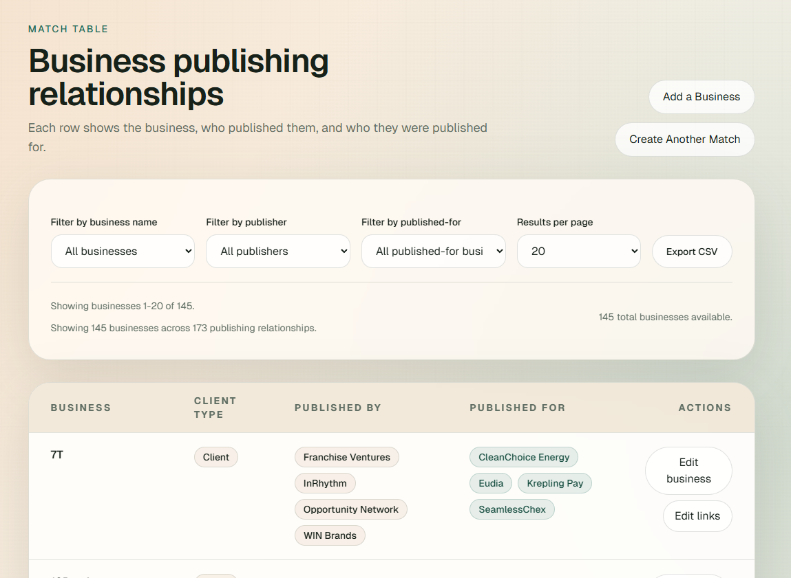

# AI Authority Exchange



This Next.js app lets you:

- create a match between two businesses from the home page
- show success and error feedback in toasts
- browse all saved matches on `/matches` with business names instead of raw IDs
- run an n8n-powered partner lookup for a specific business from `/matches`
- manage exchange rounds on `/rounds`, including draft generation, apply, clear, and temporary delete actions

## Stack

- Next.js App Router
- Prisma ORM
- Neon Postgres via `DATABASE_URL`
- Sonner for toast notifications

## Setup

1. Create your environment file from the example.
2. Set `DATABASE_URL` to your Neon connection string. If your provider gives you `sslmode=require`, replace it with `sslmode=verify-full` to match the current `pg` driver behavior without warnings.
3. Set `N8N_MATCH_FINDER_WEBHOOK_URL` to the n8n webhook that returns your business matches.
4. Optionally set `N8N_MATCH_FINDER_WEBHOOK_METHOD` to `POST` if your workflow expects a JSON body. The default is `GET`.
5. Install dependencies.
6. Run the Prisma migration if this is a fresh database.
7. Start the dev server.

```bash
cp .env.example .env
npm install
npm run db:migrate
npm run dev
```

If your Neon database already has the `businesses` and `ai_authority_exchange_matches` tables, you only need the generated client:

```bash
npm install
npm run db:generate
npm run dev
```

## Prisma

Prisma is configured with:

- schema at `prisma/schema.prisma`
- config at `prisma.config.ts`
- generated client at `generated/prisma`

Useful commands:

```bash
npm run db:generate
npm run db:migrate
npm run rounds:import -- --file ./imports/round-2.csv --round 2 --published-for-column published_for --published-by-column published_by
```

## Routes

- `/` creates a new match
- `/matches` lists all current matches
- `/matches/[businessId]` runs the n8n business match finder for one business
- `/rounds` manages round drafts and applied round history
- `/api/matches` handles match creation

## Rounds

The rounds page supports three separate workflows:

- build a draft round from the current active exchange businesses
- apply a draft round so its directional assignments are linked to matches
- temporarily delete a round batch entirely

Deleting a round batch removes its assignments and the batch itself. Existing matches are kept, but their `roundBatchId` is cleared.

## Historical Round Import

Use the CSV importer when you need to backfill older rounds onto existing matches or create missing directional matches for a historical round.

Basic usage:

```bash
npm run rounds:import -- --file ./imports/round-2.csv --round 2 --published-for-column published_for --published-by-column published_by
```

What the importer does:

- resolves businesses by name and, when provided, by website URL
- creates or updates the `RoundBatch` for the given round number
- replaces that round's `RoundAssignment` rows from the CSV
- links existing directed matches to the round
- creates missing directed matches when a historical pair does not already exist

Recommended CSV shape:

```csv
company_name,company_website_url,published_for,published_for_website_url,published_by,published_by_website_url
Acme,https://acme.com,Bravo,https://bravo.com,,
Bravo,https://bravo.com,, ,Acme,https://acme.com
```

Interpretation rules:

- `published_by` means another business hosted this row's business in that round
- `published_for` means this row's business hosted another business in that round
- each business can appear at most once as a host and once as a guest within the imported round
- rows marked inactive can be skipped with `--active-column` or `--status-column`

Useful flags:

- `--company-name-column` and `--company-website-column` when your source file uses different headers
- `--published-for-column` and `--published-by-column` to map round-specific columns like `r2_publishing` and `r2_published_by`
- `--published-for-website-column` and `--published-by-website-column` when names are ambiguous
- `--active-column` to skip rows where the round is marked inactive
- `--status-column` to skip rows with values like `Not Active`
- `--status draft` if you want to import a round without marking it applied
- `--applied-at 2026-03-01T12:00:00Z` to set a specific applied timestamp
- `--dry-run` to validate the file without writing to the database

Example with round-specific columns:

```bash
npm run rounds:import -- --file ./imports/round-2.csv --round 2 --company-name-column company_name --published-for-column r2_publishing --published-by-column r2_published_by --active-column r2_active
```

## n8n Match Finder

By default the business match page sends the selected business to your n8n webhook as query parameters. If you switch `N8N_MATCH_FINDER_WEBHOOK_METHOD` to `POST`, the same fields are sent as JSON in the request body:

```json
{
  "business_id": 123,
  "business_name": "Example Business",
  "website_url": "https://example.com",
  "business_website_url": "https://example.com"
}
```

If the webhook responds with a JSON payload shaped like this, the app renders structured match cards and also formats the summary text block:

```json
{
  "output": [
    {
      "selected_partner_id": 456,
      "partner_name": "Partner Name",
      "match_score": 92,
      "match_rationale": "Why this partner is relevant.",
      "editorial_bridge": "How the editorial angle connects.",
      "competition_rationale": "How this compares competitively.",
      "suggested_topics": ["Topic One", "Topic Two"]
    }
  ]
}
```

If the webhook returns plain text instead, the page will render that text as-is.
